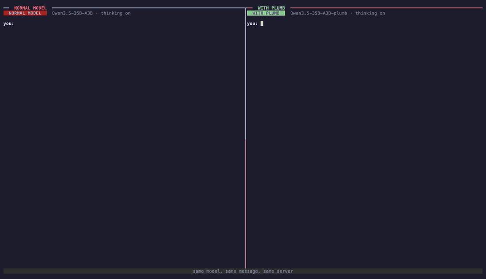
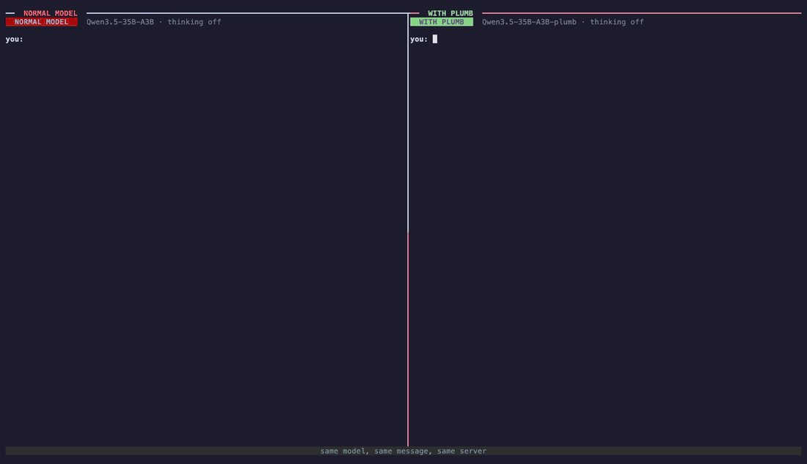

<div align="center">

# Plumbify

**Give an open LLM a fast decision path, then serve it with vLLM.**

[](https://github.com/therealnaveenkamal/plumbify/actions/workflows/ci.yml)
[](https://pypi.org/project/plumbify/)
[](https://github.com/therealnaveenkamal/plumbify/blob/main/LICENSE)
[](https://github.com/therealnaveenkamal/plumbify/blob/main/pyproject.toml)
[](https://github.com/vllm-project/vllm)

[Guide](https://github.com/therealnaveenkamal/plumbify/blob/main/docs/guide.md) · [Architecture](https://github.com/therealnaveenkamal/plumbify/blob/main/docs/architecture.md) · [Recipes](https://github.com/therealnaveenkamal/plumbify/tree/main/recipes) · [Results](#results) ·
[Changelog](https://github.com/therealnaveenkamal/plumbify/blob/main/CHANGELOG.md)

</div>

Language models are slow and inconsistent at the small judgements that fill real conversations: which team gets
this ticket, is this refund allowed, how urgent is it. Thinking helps, at the cost of seconds per decision.

Plumbify trains a small decision head, a **plumb**, onto an open model without changing its weights. With the
plugin installed, `vllm serve` loads the result like any other model. The model generates as usual, and when a
conversation reaches a decision, the plumb answers it in one forward pass, reading the KV cache the conversation
already filled, with a calibrated probability for every option.

**Faster, with thinking on.**



*Qwen3.5-35B-A3B, one server, real time, thinking on in both panes. A support case asks for two decisions: approve
the refund, and escalate to a manager. The normal model reasons both out in its thinking. The plumbed model hands
them to its plumb, which reads the conversation from the KV cache (the escalation call takes 116 ms and reuses 1,056
cached tokens). Both plumb answers come back with two options in their conformal set, which marks them as unsure, so
the model checks each one briefly before it replies. Both panes reach the same answer: approve, don't escalate. The
plumbed model finishes in 10.5 s, the normal model in 32.6 s, 3.1× faster. [Video (MP4)](https://github.com/therealnaveenkamal/plumbify/blob/main/docs/assets/refund.mp4)*

**More accurate, with thinking off.**



*Qwen3.5-35B-A3B, thinking off in both panes. A grading item states a decision: what is the correct answer, given a
student's working? The normal model agrees with the student's wrong answer, d ($278.40). The plumb picks b
($290.00), the correct answer, with probability 0.995 in 220 ms, and the model answers b. Both take under a
second. [Video (MP4)](https://github.com/therealnaveenkamal/plumbify/blob/main/docs/assets/accuracy-thinking-off.mp4)*

**A plumb is a Jev model built into the LLM.** It answers the same kind of typed decision as a Jev-style decision
model such as TypeSafe's Jev: pick one of these options, yes or no, or a score on a scale. The difference is that it
is not a second model next to the LLM. It is a Jev decision head inside the model, sharing its weights and its KV
cache, so plumbifying a model is jevifying it.

## Quickstart

Plumbify needs Linux, an NVIDIA GPU and Python 3.10 or later. The `vllm` extra installs vLLM 0.30.0, the version the
plugin is tested against.

```bash
pip install "plumbify[vllm]"
```

Train a plumb on a frozen base model, then serve the result:

```bash
plumbify train --base Qwen/Qwen3.5-9B \
    --rows train.jsonl --dev dev.jsonl --out plumbed-qwen3.5-9b
vllm serve plumbed-qwen3.5-9b
```

Ask it a decision through the standard OpenAI API:

```bash
curl -s localhost:8000/v1/chat/completions \
  -H 'content-type: application/json' \
  -d '{"model": "plumbed-qwen3.5-9b",
       "messages": [{"role": "user", "content":
         "Charged twice.\n\nWhich team?\n- billing\n- technical\n- sales"}]}' \
  | jq -c .plumb.answer
```

The response is a normal chat completion with an extra `plumb` field. Its `answer` says which option won, who
decided (`system1` is the plumb), and with what probability:

```json
{"choice":"billing","by":"system1","p":0.973}
```

The [guide](https://github.com/therealnaveenkamal/plumbify/blob/main/docs/guide.md) covers the training data format, the request options and the response fields.
`python scripts/demo_chat.py` opens a live chat that shows each decision as the model hands it off.

## Results

The same model alone and with its plumb, on one vLLM server, over 447 held-out decisions (task families and
templates no model trained on). Each prompt states a decision: context, question, bulleted options.

| Model                 | No thinking: alone → plumbed | Thinking: alone → plumbed | Thinking latency p50: alone → plumbed |
| --------------------- | ---------------------------- | ------------------------- | ------------------------------------- |
| Qwen3.5-27B           | 0.732 → **0.839**            | 0.866 → **0.875**         | 26.6 s → 17.1 s (1.6× faster)         |
| Qwen3.5-35B-A3B (MoE) | 0.720 → **0.810**            | 0.852 → **0.875**         | 6.8 s → 2.8 s (2.4× faster)           |
| Gemma 4 12B           | 0.736 → **0.826**            | 0.770 → **0.872**         | 24.1 s → 5.0 s (4.8× faster)          |
| Qwen3.5-9B            | 0.696 → **0.779**            | 0.808 → **0.846**         | 28.0 s → 5.7 s (4.9× faster)          |
| Qwen3.5-4B            | 0.667 → **0.801**            | **0.841** → 0.826         | 12.0 s → 3.8 s (3.1× faster)          |
| Qwen3-1.7B            | 0.570 → **0.658**            | 0.642 → **0.707**         | 3.9 s → 3.1 s (1.2× faster)           |

Without thinking, the plumb adds 8 to 13 points on every model. With thinking, the plumbed model is at least as
accurate on five of six models (Qwen3.5-4B is within noise) and answers 1.2 to 4.9 times faster, because it thinks
30 to 75% less: it hands the decision to the plumb instead of reasoning it all out. It also always answers, where
the model alone runs out of tokens or gives no clear answer on 5 to 15% of decisions when thinking. With 447
decisions, one standard error is about 2 points.

With thinking on, the model alone is scored in its better setup. These models think much less when their prompt
lists a tool (the plumbed model's prompt always lists `plumb_decide`), which is often but not always more accurate,
so each model alone gets whichever prompt, with or without a tool, scores higher. Settings, training time and
serving memory for each run are in [recipes/](https://github.com/therealnaveenkamal/plumbify/tree/main/recipes); the benchmark is
[`scripts/bench_s1_vs_s2.py`](https://github.com/therealnaveenkamal/plumbify/blob/main/scripts/bench_s1_vs_s2.py).

## How it works

Take a support chat that reaches a decision: *which team should handle this ticket: billing, technical or sales?*

1. **The question is added to the conversation.** The question and the three options are appended, written like a
   normal message to the model.
2. **The model reads only the new part.** It has already read the conversation, and that work is cached, so only the
   few words of the question are processed.
3. **The plumb scores the options.** It looks at what the model computed while reading the question and turns that
   into a probability per option: billing 0.97, technical 0.02, sales 0.01.
4. **The model carries on.** No text was generated for the decision. The model uses the answer and continues its
   reply.

```
conversation so far (cached)  +  "Which team? billing / technical / sales"  →  plumb  →  billing 0.97
```

Training adds two small pieces and nothing else: the plumb itself, and an adapter that switches on only while the
model reads a decision question. The model's own weights never change. The server does add the `plumb_decide` tool
and a one-line note to the system prompt, and listing a tool changes how a model reasons: these models think less
with it, on small talk as much as on decisions.
[Architecture](https://github.com/therealnaveenkamal/plumbify/blob/main/docs/architecture.md) explains each piece and
where it lives in the code.

## Documentation

| Document                                  | Covers                                                                    |
| ----------------------------------------- | ------------------------------------------------------------------------- |
| [Guide](https://github.com/therealnaveenkamal/plumbify/blob/main/docs/guide.md)                    | Install, training data, the `plumbify` commands, the serving API, limits  |
| [Architecture](https://github.com/therealnaveenkamal/plumbify/blob/main/docs/architecture.md)      | How training and serving fit together, the invariants, a map of the code |
| [Recipes](https://github.com/therealnaveenkamal/plumbify/blob/main/recipes/README.md)              | Tested settings and measured results for each model                       |
| [Scripts](https://github.com/therealnaveenkamal/plumbify/blob/main/scripts/README.md)              | Benchmark, vLLM parity check, live chat                                   |
| [Contributing](https://github.com/therealnaveenkamal/plumbify/blob/main/CONTRIBUTING.md)           | Development setup, tests, conventions                                     |

## Development

```bash
pip install -e ".[dev]" && pre-commit install
pytest -q tests
ruff check . && ruff format --check .
```

The tests run on CPU in seconds with a tiny random model and don't need vLLM. See [CONTRIBUTING.md](https://github.com/therealnaveenkamal/plumbify/blob/main/CONTRIBUTING.md).

## Citation

```bibtex
@misc{plumbify2026,
  title  = {Plumbify: a System 1 decision branch for open
            language models},
  author = {Kamalakannan, Naveenraj},
  year   = {2026},
  url    = {https://github.com/therealnaveenkamal/plumbify}
}
```

## License

[Apache-2.0](https://github.com/therealnaveenkamal/plumbify/blob/main/LICENSE).
