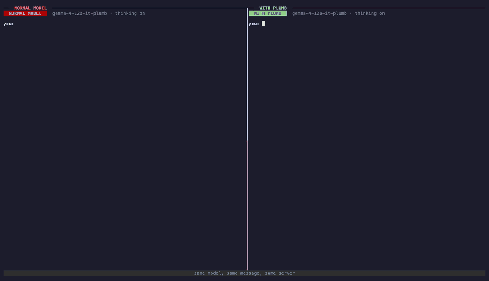

# Plumber

**Give an open LLM a fast decision path, then serve it with vLLM.**

[CI](https://github.com/therealnaveenkamal/plumber/actions/workflows/ci.yml)
[License](LICENSE)
Python
vLLM

[Guide](docs/guide.md) · [Recipes](recipes/) · [Results](#results)


Language models are slow and inconsistent at the small judgements that fill real conversations: which team gets
this ticket, is this refund allowed, how urgent is it. Thinking helps, at the cost of seconds per decision.

Plumber trains a small decision head, a **plumb**, onto an open model without changing its weights. With the
plugin installed, `vllm serve` loads the result like any other model. The model generates as usual, and when a
conversation reaches a decision, the plumb answers it in one forward pass, reading the KV cache the conversation
already filled, with a calibrated probability for every option.



*Qwen3.5-35B-A3B on one A100, real time, thinking on in both panes. Left: the normal model. Right: the same model
with its plumb, which hands the decision to System 1 mid-reply. Part of the right pane's speed comes from its prompt
listing a tool, which shortens thinking by itself; the Results table compares the two with matched prompts.*

**A plumb is a Jev model built into the LLM.** It answers the same kind of typed decision as a Jev-style decision
model such as TypeSafe's Jev: pick one of these options, yes or no, or a score on a scale. The difference is that it
is not a second model next to the LLM. It is a Jev decision head inside the model, sharing its weights and its KV
cache, so plumbifying a model is jevifying it.

## Quickstart

```bash
pip install "plumber[vllm] @ git+https://github.com/therealnaveenkamal/plumber"

plumber plumbify --base Qwen/Qwen3.5-9B --rows train.jsonl --dev dev.jsonl --out plumbed-qwen3.5-9b
vllm serve plumbed-qwen3.5-9b
```

```bash
curl -s localhost:8000/v1/chat/completions -H 'content-type: application/json' -d '{
  "model": "plumbed-qwen3.5-9b",
  "messages": [{"role": "user", "content": "Ticket: I was charged twice.\n\nWhich team should handle this?\n- billing\n- technical\n- sales"}]
}' | jq .plumb.answer
```

The [guide](docs/guide.md) covers the training data format, the request options and the response fields.
`python scripts/demo_chat.py` opens a live chat that shows each decision as the model hands it off.

## Results

The same model alone and with its plumb, on one vLLM server, over 447 held-out decisions (task families and
templates no model trained on). Each prompt states a decision: context, question, bulleted options.

| Model                 | No thinking: alone → plumbed | Thinking: alone → plumbed | Thinking latency p50: alone → plumbed |
| --------------------- | ---------------------------- | ------------------------- | ------------------------------------- |
| Qwen3.5-27B           | 0.732 → **0.839**            | 0.866 → **0.875**         | 26.6 s → 17.1 s (1.6× faster)          |
| Qwen3.5-35B-A3B (MoE) | 0.720 → **0.810**            | 0.852 → **0.875**         | 6.8 s → 2.8 s (2.4× faster)            |
| Gemma 4 12B           | 0.736 → **0.826**            | 0.770 → **0.872**         | 24.1 s → 5.0 s (4.8× faster)           |
| Qwen3.5-9B            | 0.696 → **0.779**            | 0.808 → **0.846**         | 28.0 s → 5.7 s (4.9× faster)           |
| Qwen3.5-4B            | 0.667 → **0.801**            | **0.841** → 0.826         | 12.0 s → 3.8 s (3.1× faster)           |
| Qwen3-1.7B            | 0.570 → **0.658**            | 0.642 → **0.707**         | 3.9 s → 3.1 s (1.2× faster)            |

Without thinking, the plumb adds 8 to 13 points on every model. With thinking, the plumbed model is at least as
accurate on five of six models (Qwen3.5-4B is within noise) and answers 1.2 to 4.9 times faster, because it thinks
30 to 75% less: it hands the decision to the plumb instead of reasoning it all out. It also always answers, where
the model alone runs out of tokens or gives no clear answer on 5 to 15% of decisions when thinking. With 447
decisions, one standard error is about 2 points.

With thinking on, the model alone is scored in its better setup. These models think much less when their prompt
lists a tool (the plumbed model's prompt always lists `plumb_decide`), which is often but not always more accurate,
so each model alone gets whichever prompt, with or without a tool, scores higher. Settings for each run are in
[recipes/](recipes/).

## How it works

Take a support chat that reaches a decision: *which team should handle this ticket: billing, technical or sales?*

1. **The question is added to the conversation.** The question and the three options are appended, written like a
   normal message to the model.
2. **The model reads only the new part.** It has already read the conversation, and that work is cached, so only the
   few words of the question are processed.
3. **The plumb scores the options.** It looks at what the model computed while reading the question and turns that
   into a probability per option: billing 0.97, technical 0.02, sales 0.01.
4. **The model carries on.** No text was generated for the decision. The model uses the answer and continues its
   reply.

```
conversation so far (cached)  +  "Which team? billing / technical / sales"  →  plumb  →  billing 0.97
```

Training adds two small pieces and nothing else: the plumb itself, and an adapter that switches on only while the
model reads a decision question. The model's own weights never change, so everything else it does (chat, reasoning,
tools) works exactly as before.

## Development

```bash
pip install -e ".[dev]"
pytest -q tests
ruff check . && ruff format --check .
```

See [CONTRIBUTING.md](CONTRIBUTING.md).

## Citation

```bibtex
@misc{plumber2026,
  title  = {Plumber: a System 1 decision branch for open language models},
  author = {Kamalakannan, Naveenraj},
  year   = {2026},
  url    = {https://github.com/therealnaveenkamal/plumber}
}
```


## License

Apache-2.0.