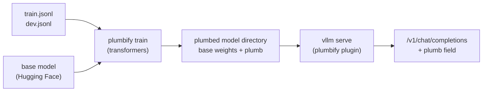
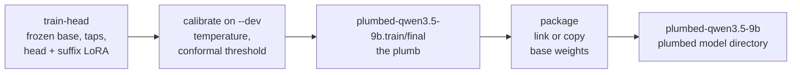
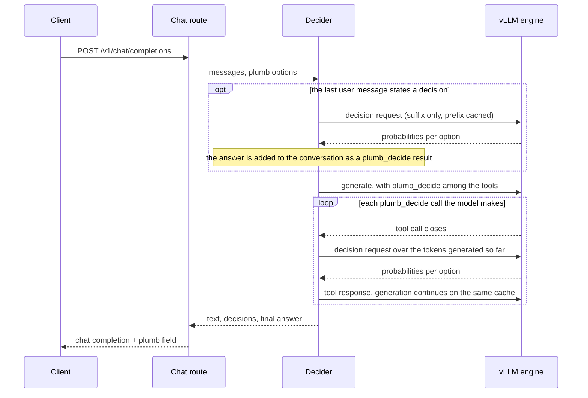

# Architecture

Plumbify has two halves that meet at a directory on disk. **Training** runs on transformers and writes a *plumbed
model directory*: the base model's files, untouched, plus the plumb. **Serving** is a vLLM plugin that loads that
directory with `vllm serve` and answers decisions from the same KV cache the model generates with. A shared core
makes sure both halves render the same tokens and read the same features.



## The pieces

| Piece | Module | What it does |
|---|---|---|
| Decision row | `core/row.py` | One decision: a state, a question, a type (`choice`, `noul`, `score`), options, and for training a gold index or a teacher distribution. |
| Rendering | `core/render.py` | Writes a decision as a user turn in the model's own chat format, appended after the context. Everything before the question is a cacheable prefix; the question, options and assistant-open are the *decision suffix*. |
| Taps | `core/taps.py` | Reads the residual stream after several decoder layers, at suffix positions only. These are the same tensors vLLM exposes as EAGLE-3 auxiliary hidden states, so training and serving see the same features. |
| Decision head | `core/decision_head.py` | A small dense transformer over the tapped suffix features. It pools each option, runs order-invariant set blocks over the question and options, and scores each option. It costs about 1% of a trunk forward. |
| Suffix-only LoRA | `core/suffix_lora.py` | An adapter that computes `base(x) + mask * B(A(x))`, with `mask` = 1 on decision-suffix tokens and 0 everywhere else. It is never merged into the base weights. |
| Calibration | `calibration.py` | Fits one temperature and a split-conformal threshold on held-out rows. The conformal set is the `result.set` field in responses. |
| Answers | `core/answers.py` | Turns option probabilities into a typed answer with a confidence and, optionally, a conformal set. |
| `plumb_decide` | `core/tool.py` | The tool schema the generating model calls to hand a decision to its plumb. Nothing external runs; the call is only a trigger. |

## Invariants

The design rests on five properties. Each one is checked by a test in `tests/` or by `scripts/vllm_check.py`.

1. **The base weights never change.** Training gives them no gradient, and the adapter is stored separately and
   never merged. *(tests/test_system1.py, tests/test_suffix_lora.py)*
2. **Context tokens are computed by the base weights alone.** The adapter's mask is zero outside the decision
   suffix, so the KV cache (and recurrent state, on hybrid models) for a conversation is exactly the base model's.
   That is what lets a decision reuse the cache a generator already filled, and why a decision costs only its
   suffix. *(tests/test_suffix_lora.py)*
3. **Generation is bit-identical to the base model.** With no decision suffix in a batch, the adapter contributes
   nothing. *(tests/test_suffix_lora.py, scripts/vllm_check.py)*
4. **Training and serving render the same token ids.** Both go through `render_decision`; the mid-generation
   suffix in `branch.decision_suffix` is checked against it. *(tests/test_branch.py)*
5. **Served decisions match the reference implementation.** vLLM's probabilities are compared with the
   transformers `System1` on held-out rows. Expect 194 or more of 200 to agree. *(scripts/vllm_check.py)*

## Training: `plumbify train`



`plumbify train` runs `train-head` and then `package`; both are also available as commands on their own. The
training directory (`<out>.train`) keeps `metrics.json` and `dev_preds.jsonl`, which `scripts/vllm_check.py` uses
as its reference. `package` writes the dev-set metrics into the directory's model card.

The output is an ordinary model directory:

```
plumbed-qwen3.5-9b/
  config.json                        base config; architectures = ["Plumb<BaseArchitecture>"]
  *.safetensors (+ index)            base weights, untouched (linked from the HF cache, or copied)
  tokenizer files, chat template, generation_config.json
  plumb.json                         plumb spec: base model, taps, head shape, calibration
  head.safetensors                   decision head
  suffix_adapter.json/.safetensors   suffix-only LoRA (absent with --no_lora)
  README.md                          model card
```

## Serving: the vLLM plugin

`pip install plumbify` registers `plumbify.serving.vllm:register` as a `vllm.general_plugins` entry point, which vLLM
calls in every process at startup. Registration does three things:

- registers a lazily-resolved `Plumb<Arch>` for every architecture vLLM supports, so any `config.json` naming
  `Plumb<BaseArchitecture>` resolves without a flag;
- gives each `Plumb<Arch>` its base architecture's config hook, and raises `max_logprobs` so a decision can return
  one probability per option;
- in the API server process, replaces the `/v1/chat/completions` route with the plumb-aware one. Models without a
  plumb fall through to vLLM's own handler.

Inside the engine, the plumb is attached to vLLM's own model class:

| Module | Role |
|---|---|
| `serving/vllm/model.py` | `Plumb<Arch>` subclasses vLLM's class for `<Arch>`. Base weights load through the base class unchanged. The suffix adapter is stacked onto vLLM's fused linear layers, the tapped layers are copied to a buffer each forward, and `compute_logits` answers a decision request: option *k* is token id *k*, every other token is `-inf`. |
| `serving/vllm/hooks.py` | Wraps four methods of vLLM's model runner. They carry per-request decision metadata (suffix start, option spans, option count) from `SamplingParams.extra_args` to the model, set the per-token adapter mask before each forward, and run the head after it. Each wrapper is a no-op for models without a plumb. |
| `serving/vllm/client.py` | `Decider` drives the chat loop on the server's engine. A decision request is an ordinary one-token, greedy generation request whose prefix is mostly served from the prefix cache; the answer comes back as logprobs over the options. |
| `serving/vllm/decisions.py` | Finds a decision stated in a user message (a question followed by a bulleted option list) and maps a tool call's options back onto it. |
| `serving/vllm/openai.py` | The OpenAI-compatible route: request options, streaming, the `plumb` response field, and the fallback to vLLM's handler. |

### One request



For a stated decision, the final `answer` is the plumb's choice when its top probability is at least `trust`
(default 0.7), or when the model's reply names no option; otherwise it is the option the model committed to. A
client tool call ends the turn and is returned as an ordinary `tool_calls` entry.

## Reference implementation

`System1` (`system1.py`) runs a plumb on transformers: load a plumbed directory, call `decide` on rows, optionally
over a conversation. Rows that share a context prefill it once and fork its cache. `branch.py` runs decisions inside
a live transformers generation: it checkpoints the cache, appends the decision suffix, reads the answer, and rolls
the cache back exactly. The tests use both, and `scripts/vllm_check.py` compares the vLLM plugin against them.

## Coupling to vLLM

The plugin reaches into vLLM internals in the places below. Each is marked `vLLM-internal` in the code, with the
vLLM file it depends on:

| Touchpoint | vLLM file | Plumbify module |
|---|---|---|
| Resolving the base model class | `vllm/model_executor/models/registry.py` | `serving/vllm/model.py` |
| Per-architecture config hooks | `vllm/model_executor/models/config.py` | `serving/vllm/__init__.py` |
| EAGLE-3 auxiliary hidden states (the taps) | `vllm/model_executor/models/interfaces.py` | `serving/vllm/model.py` |
| Compiled-graph cache key (`additional_config`) | `vllm/config/vllm.py` | `serving/vllm/model.py` |
| Model runner methods | `vllm/v1/worker/gpu/model_runner.py` | `serving/vllm/hooks.py` |
| Engine client model config | `vllm/engine/protocol.py` | `serving/vllm/client.py` |
| Chat completion route | `vllm/entrypoints/openai/chat_completion/api_router.py` | `serving/vllm/openai.py` |

`TESTED_VLLM` in `serving/vllm/__init__.py` lists the versions these were written against. Other versions load with
a warning. Upgrading is described in [CONTRIBUTING.md](../CONTRIBUTING.md#upgrading-vllm).

## Code map

```
plumbify/
  cli.py                 `plumbify <command>` dispatcher
  core/                  shared by training and serving
    row.py               the decision row
    render.py            decision rendering in the model's chat format
    taps.py              layer taps at the decision suffix
    decision_head.py     the decision head and its loss
    suffix_lora.py       suffix-only LoRA
    targets.py           LoRA target modules per architecture
    answers.py           probabilities -> typed answers
    tool.py              the plumb_decide tool
  training/
    plumbify.py          `plumbify train`: train, calibrate, package
    train_head.py        `plumbify train-head`
    eval_head.py         `plumbify eval-head` (a plumb, or the base model zero-shot)
    data.py              row loading and length-bucketed batches
  serving/vllm/          the vLLM plugin (see above)
  system1.py             reference implementation on transformers
  branch.py              decisions inside a live transformers generation
  artifact.py            the plumb on disk: spec, head, adapter
  plumbed.py             the plumbed model directory and its model card
  calibration.py         temperature scaling and split-conformal sets
  metrics.py             accuracy, NLL, Brier, ECE, coverage
recipes/                 one tested script per model, and the runner they share
scripts/                 benchmark, results table, vLLM parity check, live chat
tests/                   CPU tests on a tiny random hybrid model
```
